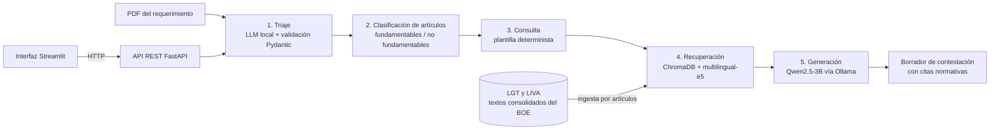

# Plataforma de IA generativa para asesorías

Prototipo que procesa requerimientos de la Agencia Tributaria (AEAT) sobre IRPF e IVA:
extrae sus datos clave, recupera los artículos aplicables de la normativa y redacta un
borrador de contestación que cita solo lo que ha recuperado. Todo se ejecuta **en local**,
sin enviar datos fiscales a servicios externos, para cumplir el RGPD.

**Trabajo Fin de Grado** — Grado en Ingeniería Informática, Universidad de Málaga (2026).
Calificación: 8,2. Autor: Daniel Márquez Polonio. Tutor: Francisco López Valverde.

**Stack:** Python 3.12 · LangChain · ChromaDB · multilingual-e5 · Ollama (Qwen2.5-3B) ·
Pydantic · FastAPI · Streamlit

<!-- Añade aquí una captura o un GIF de la interfaz:

-->

## Cómo funciona



1. **Triaje** (`src/triaje.py`): extrae del PDF nueve campos estructurados (tipo de
   documento, NIF, impuesto, ejercicio, periodo, importe, plazo, artículos citados…) y los
   valida con Pydantic, con reintentos si la salida del modelo no cumple el esquema.
2. **Clasificación** (`src/cadena.py`): separa los artículos que pueden fundamentarse con el
   índice de los que no, verificándolos contra los metadatos reales del índice.
3. **Consulta**: se construye con una plantilla determinista, sin LLM.
4. **Recuperación** (`src/query.py`): búsqueda semántica sobre la normativa, troceada por
   artículos (`src/legal_splitter.py`).
5. **Generación**: una única llamada al modelo con un prompt que obliga a fundamentar solo
   en los fragmentos recuperados.

## Resultados

Evaluación sobre un corpus sintético de 14 requerimientos y 15 preguntas anotadas.
El detalle está en `eval/` y en el capítulo 5 de la memoria.

| Fase | Métrica | Resultado |
|---|---|---:|
| Recuperación | Cobertura (Recall@5) | 93,3 % |
| Recuperación | MRR | 0,847 |
| Triaje | Validación de esquema | 100 % |
| Triaje | F1 laxo en extracción de referencias normativas | 96,9 % |
| Triaje | Atribución correcta de la norma | 48,7 % |
| Generación | Citas fundamentadas en fragmentos recuperados | 91,5 % |
| Generación | Alucinación normativa | 3,4 % |

La segmentación por artículos se validó con una ablación frente al troceado de longitud
fija (`eval/tabla_comparativa_chunking.md`).

## Limitaciones conocidas

- **Atribución de norma débil en el triaje** (48,7 %): el modelo tiende a asignar a la
  LIRPF artículos procedimentales de la LGT.
- **Modo de fallo silencioso**: un error de atribución en el triaje puede propagarse por la
  recuperación hasta el borrador sin que ningún control lo detecte, generando un documento
  formalmente válido pero incorrecto.
- La detección de alucinaciones cubre las **referencias normativas**, no los datos de hecho
  (fechas, números de expediente).
- La salida del modelo **varía entre ejecuciones** con la misma entrada.
- El MVP no tiene autenticación ni persistencia: los expedientes viven en memoria.

## Estructura del repositorio

- `src/` — ingesta y particionado del corpus normativo, recuperación semántica, triaje con
  validación Pydantic, cadena completa de generación y scripts de evaluación.
- `api/` — backend FastAPI con cuatro endpoints (`/expedientes`).
- `app/` — interfaz Streamlit de página única.
- `eval/` — conjuntos de referencia anotados, resultados en JSON y tablas en Markdown.
- `tools/corpus/` — generador del corpus sintético de requerimientos y de su anotación,
  con el script que verifica ambos.
- `modelfile/` — Modelfile para crear en Ollama el modelo generativo.
- `data/normativa/` — textos consolidados del BOE (no se versionan; ver instalación).

> Los requerimientos de `eval/corpus_triaje/` son **documentos ficticios** generados para la
> evaluación. Llevan un aviso explícito y no contienen datos reales.

## Instalación y ejecución

Probado en Windows con PowerShell. Requisitos: Python 3.12 y [Ollama](https://ollama.com).

**1. Entorno virtual y dependencias**

```powershell
python -m venv .venv
.\.venv\Scripts\Activate.ps1
pip install -r requirements.lock.txt
```

Si no tienes GPU NVIDIA, instala antes PyTorch para CPU para evitar descargar las ruedas con CUDA:
`pip install torch --index-url https://download.pytorch.org/whl/cpu`

**2. Normativa del BOE**

```powershell
New-Item -ItemType Directory -Force data\normativa | Out-Null
Invoke-WebRequest https://www.boe.es/buscar/pdf/2003/BOE-A-2003-23186-consolidado.pdf -OutFile data\normativa\BOE-A-2003-23186-consolidado.pdf
Invoke-WebRequest https://www.boe.es/buscar/pdf/1992/BOE-A-1992-28740-consolidado.pdf -OutFile data\normativa\BOE-A-1992-28740-consolidado.pdf
```

**3. Modelo generativo en Ollama**

```powershell
ollama pull qwen2.5:3b-instruct
ollama create qwen3b-tfg -f modelfile\Modelfile
```

**4. Índice vectorial**

```powershell
python src\ingest.py --reset
```

**5. Arrancar la demo** (dos terminales)

```powershell
uvicorn api.main:app --port 8000
streamlit run app\interfaz.py
```

**Reproducir las evaluaciones**

```powershell
python src\evaluate.py            # recuperación
python src\evaluar_triaje.py      # triaje
python src\evaluar_drafting.py    # generación
```

Para regenerar el corpus sintético hace falta ReportLab:

```powershell
pip install reportlab
python tools\corpus\build_corpus.py
```

## Licencia

Código publicado bajo licencia MIT (ver `LICENSE`).
